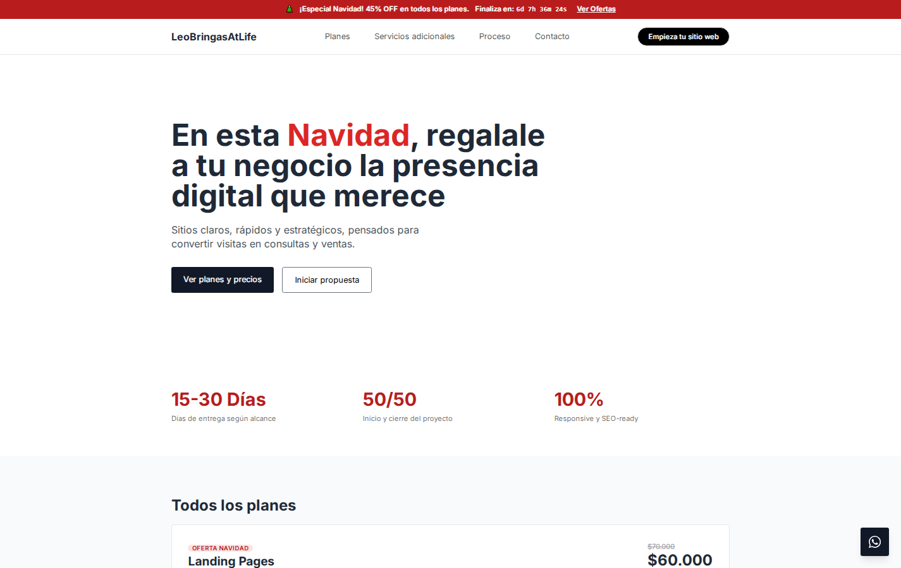

# Desarrollo Web Profesional

Plataforma de servicios de desarrollo web liderada por **Leonardo Bringas**, enfocada en crear sitios web claros, rápidos y estratégicos, pensados para convertir visitas en consultas y ventas.

### Descripción

**LeoBringasAtLife** ofrece soluciones web profesionales adaptadas a las necesidades de cada negocio. El proyecto se destaca por una arquitectura limpia y escalable, garantizando:

- **Mantenimiento sencillo.**
- **Rendimiento óptimo.**
- **Experiencia de usuario excepcional.**
- **Diseño moderno y funcional.**

<br/>




[Visitar sitio web](https://leobringasatlife.site)

### Ventajas Competitivas

- **Entregas Ágiles:** 15-30 días según el alcance del proyecto.
- **Pago Flexible:** 50% al inicio para reservar agenda y 50% contra entrega final.
- **100% Responsive:** Sitios optimizados para todos los dispositivos móviles y de escritorio.
- **SEO Ready:** Estructura optimizada para el posicionamiento en buscadores.

### Planes y Servicios

| Plan                      | Descripción                                                   | Tiempo de Entrega | Precio (ARS) |
| :------------------------ | :------------------------------------------------------------ | :---------------- | :----------- |
| **Landing Page**          | Página única optimizada para conversión. Ideal para campañas. | 15-20 días        | $60.000      |
| **Sitio Web Profesional** | 3 a 5 páginas (Inicio, Servicios, Contacto, etc.).            | 20-30 días        | $100.000     |
| **Sitio Web Completo**    | 5 a 7 páginas. Incluye Blog, FAQ y animaciones.               | 30-45 días        | $190.000     |
| **Blog Profesional**      | Plataforma de contenido con categorías y newsletter.          | 20-30 días        | $130.000     |
| **E-commerce**            | Tienda online completa con gestión de productos y pagos.      | 45-60 días        | $250.000     |

_> Nota: Los precios corresponden a la oferta actual y pueden variar._

### Servicios Adicionales

Opciones para potenciar tu proyecto o delegar tareas específicas:

- **Mantenimiento Mensual:** Backups, seguridad y actualizaciones ($18.000/mes).
- **SEO Avanzado:** Investigación de keywords y optimización técnica ($15.000).
- **Landing Urgente:** Entrega prioritaria en 24-48 hs (+$20.000).
- **Carga de Productos:** Gestión de catálogo para e-commerce.
- **Branding Básico:** Diseño de logo optimizado para web ($10.000).
- **Hosting + Dominio:** Gestión integral del alojamiento y nombre del sitio.

### Proceso de Trabajo

Nuestro flujo de trabajo consta de 8 pasos claros para garantizar resultados:

1.  **Contacto inicial:** Relevamiento de necesidades.
2.  **Propuesta:** Alcance, plazos y presupuesto.
3.  **Confirmación:** Abono del 50% de anticipo.
4.  **Desarrollo:** Diseño y programación del sitio.
5.  **Revisión:** Presentación de avances y ajustes.
6.  **Pago final:** Cancelación del 50% restante.
7.  **Publicación:** Puesta en línea del sitio.
8.  **Soporte inicial:** Acompañamiento post-lanzamiento.

### Tecnologías Utilizadas

#### Frontend

- **HTML5:** Estructura semántica.
- **CSS3 / Tailwind CSS:** Estilos modernos y diseño responsive.
- **JavaScript (ES6+):** Interactividad y lógica del cliente.

#### Optimización y Herramientas

- **SEO:** Meta tags, Open Graph, Twitter Cards.
- **Performance:** Carga optimizada y buenas prácticas.
- **Google Fonts:** Tipografía 'Inter'.
- **Iconografía:** SVG optimizados.

### Estructura del Proyecto

```
website-landing/
│
├── index.html              # Archivo principal
├── README.md               # Documentación del proyecto
│
├── assets/                 # Recursos estáticos
│   ├── image/              # Imágenes y gráficos
│   │   └── favicon.ico     # Favicon del sitio
│   ├── css/                # Hojas de estilo
│   │   ├── global.css      # Estilos base
│   │   ├── fonts.css       # Fuentes
│   └── javascript/         # Scripts JavaScript
│       └── main.js         # Lógica principal
```

### Contacto

¿Listo para iniciar tu proyecto?

- **WhatsApp:** [+54 11 2541-7299](https://wa.me/5491125417299)
- **Email:** [leonardoisaiasbringas34@gmail.com](mailto:leonardoisaiasbringas34@gmail.com)
- **Instagram:** [@leobringasatlife](https://instagram.com/leobringasatlife)
- **Sitio Web:** [leobringasatlife.site](https://leobringasatlife.site)

---

**¡HAGAMOS REALIDAD TU PRESENCIA ONLINE! 🚀**
